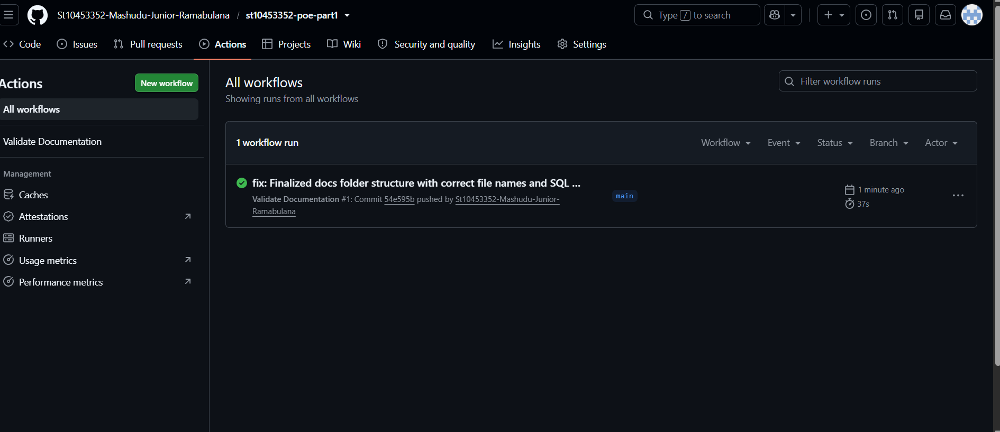

 RaceDay - Event Management System

**Student:** Mashudu Junior Ramabulana  
**Student Number:** ST10453352  
**Module:** Part 1 - System Planning

 Project Description
RaceDay is a full-stack web-based event management system designed for the South African road running, walking, and cycling community. It allows Event Organisers to create and manage events, while Participants can browse, enter, and track their performance.

Repository Roles
1. **Organiser:** Can create events, manage categories, and capture participant results.
2. **Participant:** Can browse events, enroll in categories, and view their personal performance history.

 Features
- User registration and role-based login (Organiser / Participant)
- Event creation and management by Organisers
- Category management (distance, entry fee) per event
- Participant enrollment into categories
- Results capture and leaderboards
- Live weather and route information for race day preparation

 Tech Stack (Planned)
- **Backend:** C# RESTful API (.NET)
- **Database:** MySQL / SQL Server
- **Frontend:** ASP.NET Core MVC
- **Cloud Storage:** Azure Blob Storage
- **Containerisation:** Docker
- **CI/CD:** GitHub Actions

 CI/CD Status

 CI/CD Verification
The GitHub Actions workflow confirms that all required planning documents are present in the `/docs` folder.

 SQL Verification
The database script (`docs/RaceDayDB.sql`) was successfully tested in MySQL Workbench. All tables were created and seed data was inserted without errors.

Documentation
All planning documents are located in the `/docs` folder:
- **ERD.png:** Entity Relationship Diagram
- **EndpointPlan.md:** API Endpoint Specification
- **RaceDayDB.sql:** SQL Database Schema and Seed Data

 Getting Started
1. Clone the repository: `git clone <repo-url>`
2. Open `docs/RaceDayDB.sql` in MySQL Workbench and execute it.
3. Verify all tables and seed data were created successfully.
4. (Part 2) Run the API project once available.

 Project Status
- [x] Part 1: System Planning and Database (Complete)
- [ ] Part 2: RESTful API Development (Upcoming)
- [ ] Part 3: MVC Web Application and Dockerisation (Upcoming)

 Project Walkthrough Video
https://youtu.be/7tfJL1uxUWo

Author
Mashudu Junior Ramabulana 
Student Number: ST10453352  
Module: Part 1 - System Planning

